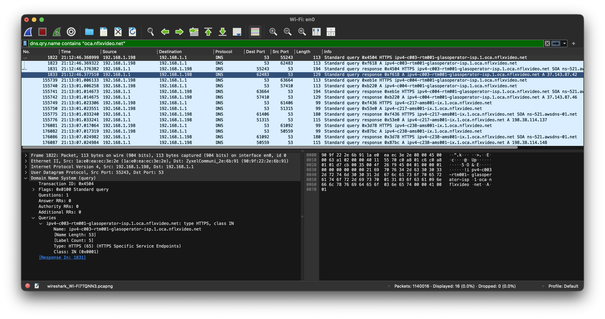

Good internet monitoring comes down to two choices: the right protocol and the right target. A bad target — one that rate-limits probes or sits outside your ISP's network — produces data that reflects the target's behaviour, not your connection. This post covers both.

## Protocols

| Protocol | What it measures | Best for | Watch out for |
|----------|-----------------|----------|---------------|
| ICMP | Round-trip latency, packet loss | Baseline connectivity, packet loss trends | Can be deprioritized or blocked by routers under load |
| DNS | Resolver response time | Detecting DNS outages, ISP resolver issues | Caching can mask latency; slow DNS ≠ slow internet |
| TCP | Connection establishment time to a specific port | Realistic reachability check without app overhead | Requires an open port on the target; firewalls may interfere |

## Targets

### ICMP

Use your **ISP's default gateway** — the first hop out of your router. Always responds, always local. Find it with `traceroute`.

Avoid using intermediate traceroute hops as targets. Routers deprioritize ICMP to their own interfaces by design, so a hop showing packet loss may be forwarding your traffic just fine. It tells you nothing about your connection to the actual endpoint.

### DNS

Monitor two resolvers and compare them:

- **Your ISP's assigned resolver** — handed out via DHCP on your router's WAN interface, not necessarily what your client machines use. Check your router's internet/WAN status page for the DNS servers it received from the ISP. Slow response points to a DNS issue on your ISP's side.
- **A secondary public resolver** (`9.9.9.9` from Quad9) — if your ISP resolver is slow but this is fine, the problem is your ISP's DNS, not your connection.

### TCP

CDN edge nodes are the best option — they have port 80/443 open, stable IPs, and are anchored close to your region. Covered in depth below.

## Multi-Target Strategy

Monitor at multiple network distances to isolate where a problem is:

1. **Your CPE/router** (your modem/router) — problem inside your home network
2. **ISP first hop** — problem on your local loop (DSL line, cable, fibre ONT)
3. **CDN edge** — problem between your ISP and the wider internet

## Discovering Your ISP's Infrastructure

Run a traceroute to any external address — the first couple of hops typically belong to your ISP:

```bash
traceroute 1.1.1.1
```

Use [bgp.tools][1] or [ipinfo.io][2] to confirm which ASN an IP belongs to — both are free tools for looking up which network owns an IP address. Note that ISPs sometimes use private ranges (`10.0.0.0/8`, `172.16.0.0/12`, `192.168.0.0/16`) or Carrier-Grade NAT space (`100.64.0.0/10`) on their infrastructure — hops in these ranges are still inside your ISP's network.

Once you have a candidate, verify it with MTR before adding it to your monitoring setup. MTR combines traceroute and ping into a single tool, continuously updating per-hop latency and packet loss — making it easy to confirm a target responds consistently:

```bash
mtr --aslookup --report-cycles 60 --report-wide <target-ip>
```

Example:

```bash
Start: 2026-04-13T20:09:02+0200
HOST: un100p                                    Loss%   Snt   Last   Avg  Best  Wrst StDev
  1. AS???    home                               0.0%    60    0.8   0.9   0.7   1.2   0.1
  2. AS50266  1-96-254-92.ftth.glasoperator.nl   0.0%    60    3.1   3.1   2.3   4.1   0.3
  3. AS???    10.227.161.253                     0.0%    60    4.6   4.1   3.3   4.6   0.3
  4. AS???    10.226.11.40                       0.0%    60    4.3   4.2   3.6   5.0   0.3
  5. AS13335  141.101.65.28                      6.7%    60    7.8  70.1   5.2 165.1  51.0
  6. AS???    ams-ix.as13335.net                 0.0%    60   29.9  12.6   4.4  31.8   8.0
  7. AS13335  141.101.65.28                      0.0%    60    5.2   7.6   4.5  31.1   5.0
  8. AS13335  141.101.65.14                      0.0%    60    8.5   9.0   4.7  37.3   5.9
  9. AS13335  one.one.one.one                    0.0%    60    4.7   4.7   4.1   6.0   0.3
```

In this example, `1.1.1.1` is used as the destination only to reveal the path — not as a monitoring target. The good ICMP candidates are hops 3 and 4 (private IPs inside the ISP's network) and hop 2 (the FTTH gateway with a resolvable hostname). Hop 5 shows 6.7% packet loss — this is rate-limiting on a Cloudflare router interface, not real loss on the path, which is exactly the intermediate hop problem described above. Hop 9 reaches the destination with 0% loss, confirming the connection itself is fine.

## CDN Targets

When you stream a video, open a website, or scroll through social media, the traffic rarely travels all the way to an origin server in some distant data center. Instead, it comes from a CDN edge node — a server sitting close to you, typically at an Internet Exchange Point (IXP), a facility where ISPs and content networks interconnect, near your ISP. Understanding this is key to choosing monitoring targets that actually reflect your internet experience.

### Major CDN Providers

| Provider | ASN | Serves |
|----------|-----|--------|
| Cloudflare | AS13335 | Web, DNS, streaming, SaaS |
| Google | AS15169 | YouTube, Search, Play, Workspace |
| Meta | AS32934 | Facebook, Instagram, WhatsApp |

Most large CDNs peer directly with ISPs at internet exchange points, so a CDN edge node typically sits just 1–2 hops past your ISP's network. CDNs use anycast — the same IP is announced from multiple locations, so your traffic always lands on the nearest edge. This makes CDN IPs ideal monitoring targets: stable, geographically consistent, and right at the boundary between your ISP and the wider internet.

### Finding CDN Edge Nodes

CDNs use DNS to steer users to the nearest edge node — resolving a CDN domain gives you a local edge IP. Use the content delivery domain, not the website frontend (e.g. `googlevideo.com` serves YouTube video traffic, `youtube.com` serves the website UI — they're often different servers):

```bash
dig A speed.cloudflare.com       # Cloudflare edge
dig A googlevideo.com            # Google / YouTube video CDN
dig A scontent.cdninstagram.com  # Meta CDN
```

The returned IPs are geographically close to you. Verify any candidate with MTR as described above before adding it to your monitoring setup. If a CDN IP shows loss or unstable RTT, try another — edge nodes are numerous and there's usually a better one nearby.

## ISP-Hosted CDN Caches

Some content providers go a step further than peering at an IXP — they place caching servers directly inside ISP networks. Netflix does this with Open Connect Appliances (OCAs): purpose-built servers pre-filled with popular content, installed in the ISP's own infrastructure. When you stream Netflix, the video comes from one of these local servers, not from a Netflix data center across the internet.

This makes them excellent monitoring targets:

- **Very low RTT** — significantly lower than internet-facing targets, since traffic never leaves your ISP's AS
- **No rate-limiting** — these servers are built to handle high traffic volumes
- **Reflects real traffic paths** — your Netflix streams come from exactly these servers
- **Clear fault isolation** — if a local node degrades, the problem is between your home and your ISP; if it's fine but internet-facing targets degrade, the problem is further upstream

Start with fast.com — it takes 30 seconds. Use Wireshark if you want to dig deeper or fast.com doesn't give clean results.

### Using fast.com

[fast.com][3] is Netflix's speed test, which runs against the same OCA infrastructure used for streaming. Open your browser's developer tools (Network tab), run the speed test, and look at the request IPs — these are live OCA endpoints actively serving your region. Use [bgp.tools][1] to confirm: if the IP belongs to your ISP's AS (not Netflix's), it's locally hosted.

### Wireshark

Start a Wireshark capture on your network interface before opening Netflix. When a stream begins, your device queries DNS for OCA hostnames and immediately connects to the returned IPs.

Apply this display filter by pasting it into Wireshark's display filter bar (the bar at the top that reads *Apply a display filter*):

```
dns.qry.name contains "oca.nflxvideo.net"
```

**Note:** Other local caches use their own recognizable domains — Apple uses `edge.apple`, Google/YouTube uses `googlevideo.com`, and Steam/Valve uses `steamcontent.com`.

The DNS response A records are your OCA IPs. The hostname typically includes an abbreviation of your ISP's name, making it easy to confirm you're looking at a locally hosted node.



### MTR

Run MTR against one of the IPs you found:

```bash
mtr --aslookup --report-cycles 30 --report-wide <oca-ip>
```

Example output for a locally hosted OCA:

```
Start: 2026-04-13T21:30:26+0200
HOST: un100p                                     Loss%   Snt   Last   Avg  Best  Wrst StDev
  1. AS???    home                                0.0%    60    1.1   0.9   0.6   1.1   0.2
  2. AS50266  1-96-254-92.ftth.glasoperator.nl    0.0%    60    3.8   3.2   2.3   5.1   0.4
  3. AS???    10.227.173.213                      0.0%    60    2.9   3.0   2.5   3.6   0.3
  4. AS???    10.226.11.37                        0.0%    60    2.6   2.9   2.4   3.6   0.2
  5. AS50266  42-87-143-37.ftth.glasoperator.nl   0.0%    60    3.8   3.5   2.7   4.7   0.4
```

The OCA is reachable in 5 hops with 0% packet loss. All hops stay within AS50266 (Autonomous System 50266, my ISP's routing domain — yours will show a different number), which is expected: Netflix OCAs hosted inside an ISP use IPs from the ISP's own address space, not Netflix's. If you see all hops within your ISP's AS, the node is locally hosted.

A confirmed local CDN node should stay entirely within your ISP's AS with no packet loss — as shown above. If hops leave your ISP's AS, the node isn't locally hosted and isn't worth using as a monitoring target.

## Building Your Target List

You should now have a set of verified IPs covering different network distances:

- **ISP gateway and DNS resolvers** — degrade when the problem is inside your home network or on your local loop
- **CDN edge nodes** (1–2 hops past your ISP) — degrade when there's a problem between your ISP and the internet
- **ISP-hosted caches** (entirely within your ISP's AS) — degrade when there's a problem between your home and your ISP

Together, these give you complete coverage to isolate exactly where a problem is. Feed them into whatever monitoring tool graphs latency and packet loss for you, and you'll be able to tell at a glance which layer a problem sits in.

[1]: https://bgp.tools
[2]: https://ipinfo.io
[3]: https://fast.com
