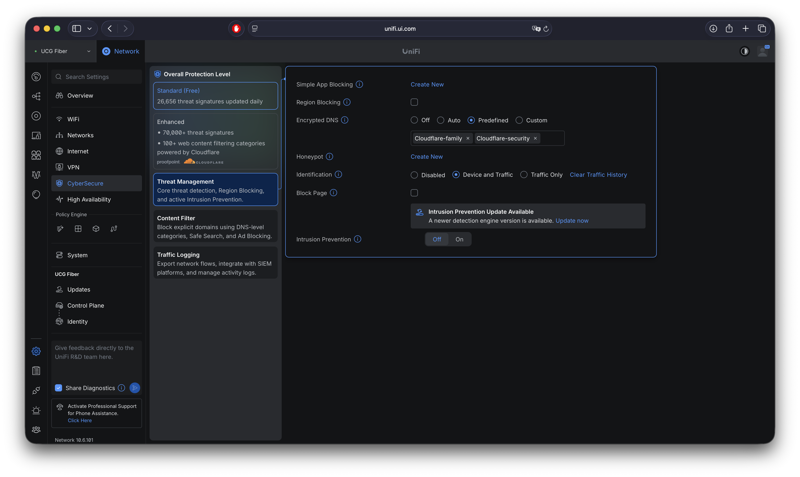

[Encrypted DNS]() is most useful at the resolver level — one place to configure, full network coverage, local DNS behavior unchanged. On UniFi that means the gateway itself, which ships a handful of predefined DNS-over-HTTPS providers instead of making you hand-roll the config. This post sets that up and compares the built-in options against each other, rather than just picking one and moving on.

> This post is based on UniFi Network **10.6.101** — menu paths and options may differ on other versions.

## Prerequisites

- A UniFi gateway running a recent UniFi OS/Network application release.

## UniFi's Built-in Encrypted DNS Options

Instead of pointing the gateway at a plain DNS IP, UniFi lets you pick a provider from a predefined list and queries go out over DoH instead of plaintext port 53:

| Provider | Focus |
|---|---|
| Cloudflare | General-purpose, privacy-first, independently audited no-log policy |
| Google | General-purpose, widest anycast footprint |
| Quad9 | Malware/phishing domain blocking built into the resolver itself |
| OpenDNS (Cisco) | Optional content-filtering tiers (family, security) |
| NextDNS | Per-account configurable filtering and analytics |
| CleanBrowsing | Filtering-focused (family/adult/security profiles) |
| Custom | Any DoH endpoint you supply |

The actual dropdown is longer than this table — a handful of other providers show up alongside these. A couple of things worth calling out explicitly rather than assuming "one entry per provider":

- **Some providers aren't a single option.** They're split into filtering profiles — plain resolution, malware blocking, malware + adult content, and so on — rather than one generic entry, the same way Quad9 and CleanBrowsing already separate by filtering tier. Picking a provider can mean picking which of those profiles you actually want.
- **IPv4 and IPv6 are separate address lists per provider.** A provider resolving fine over IPv4 doesn't guarantee the same endpoint/behavior over IPv6 — 

## Setting It Up

Under **Settings → CyberSecure → Threat Management**, the encrypted DNS option sits alongside UniFi's other network-protection features rather than under plain Internet/WAN settings:



Switching it on exposes the provider dropdown; picking Custom instead asks for a DoH endpoint URL directly.

A few things worth knowing before you flip it on:

- **This is a gateway-level, not a client-level, setting.** It encrypts the hop between your gateway and the upstream resolver. LAN clients still talk to the gateway over plain DNS on port 53 — that part doesn't change, and doesn't need to, since it never leaves your network.
- **Scope is site-wide**, not per WAN or per network — one setting covers the whole site.
- **Multiple servers get benchmarked and raced, not just used as a strict primary/fallback pair.** As the dnscrypt-proxy log further down shows, every enabled server gets an initial latency check and queries route to whichever is fastest at the time. That's also why it's worth enabling more than one provider/profile rather than just one: it gives dnscrypt-proxy options to route around if a given server gets slow or drops out, instead of a single point of failure.

## Comparing the Predefined Providers

The dropdown makes all of these look equivalent — pick one from a list — but they're not interchangeable. Latency is entirely dependent on which provider has an edge node close to *your* connection, so it's not something to compare from a table — check it yourself with the per-query log further down. "Filtering" is the more meaningful axis, and it ranges from none to opinionated-by-default:

| Provider | Filtering | Logging / privacy notes |
|---|---|---|
| Cloudflare | None by default | Third-party audited to confirm no query logging beyond aggregate, anonymized stats |
| Google | None | Logs a sample of queries; published retention/anonymization policy |
| Quad9 | Malware/phishing blocking, always on | Nonprofit-run; no logging of client IPs tied to queries |
| OpenDNS | Optional, tier-dependent | Cisco-owned; free tier ties usage to account if you enable filtering |
| NextDNS | Fully configurable per profile | Logging is opt-in and configurable per profile |
| CleanBrowsing | Filtering-first (family/security/adult) | Positions itself as no-log for DNS resolution |

## Verifying It's Actually Encrypted

A few ways to confirm the gateway is really sending DoH and not silently falling back to plaintext:

- **Cloudflare's own check** — from a client behind the gateway, visiting `https://1.1.1.1/help` reports whether the query that loaded the page went over DoH. Only useful when Cloudflare is the selected provider.
- **Packet capture on the WAN interface** — filter for port 53 (`tcp or udp port 53`) and look for your client queries showing up as TLS traffic to the provider's DoH endpoint on 443 instead. Don't expect port 53 to go completely silent, though: the gateway itself still generates its own plaintext DNS lookups (firmware/update checks, NTP, cloud connectivity) independent of the resolver path client queries use — that traffic isn't a sign encryption failed, it's just not what you're checking.
- **SSH into the gateway and tail the dnscrypt-proxy log** — UniFi implements this feature on top of [dnscrypt-proxy](https://github.com/DNSCrypt/dnscrypt-proxy), and its log at `/var/log/dnscrypt-proxy.log` shows exactly which upstream servers it negotiated DoH with and the measured round-trip time:

  ```
  tail -f /var/log/dnscrypt-proxy.log

  [2026-09-14 20:42:18] [NOTICE] Source [public-resolvers] loaded
  [2026-09-14 20:42:18] [NOTICE] Firefox workaround initialized
  [2026-09-14 20:42:18] [NOTICE] Hot reload is disabled
  [2026-09-14 20:42:19] [NOTICE] [cloudflare-security] OK (DoH) - rtt: 29ms
  [2026-09-14 20:42:19] [NOTICE] [cloudflare-family] OK (DoH) - rtt: 22ms
  [2026-09-14 20:42:19] [NOTICE] Sorted latencies:
  [2026-09-14 20:42:19] [NOTICE] -    22ms cloudflare-family
  [2026-09-14 20:42:19] [NOTICE] -    29ms cloudflare-security
  [2026-09-14 20:42:19] [NOTICE] Server with the lowest initial latency: cloudflare-family (rtt: 22ms)
  [2026-09-14 20:42:19] [NOTICE] dnscrypt-proxy is ready - live servers: 2
  ```

  This is also the most direct way to confirm which named profile got selected when a provider entry expands into more than one server (`cloudflare-security` vs `cloudflare-family` here) — dnscrypt-proxy benchmarks each live server's RTT on startup and routes to the lowest-latency one.

- **Tail the per-query log** — `/var/log/query-dnscrypt-proxy.log` logs every individual query dnscrypt-proxy handles, with its result and latency:

  ```
  tail -f /var/log/query-dnscrypt-proxy.log

  [2026-09-14 20:52:43]	127.0.0.1	ui.com	A	PASS	7ms	cloudflare-security
  [2026-09-14 20:52:55]	127.0.0.1	41-courier2.push.apple.com	A	PASS	11ms	cloudflare-security
  [2026-09-14 20:52:55]	127.0.0.1	time.apple.com	A	PASS	12ms	cloudflare-security
  [2026-09-14 20:52:59]	127.0.0.1	mobile.events.data.microsoft.com	A	PASS	10ms	cloudflare-security
  ```

  Every query shows `127.0.0.1` as the source rather than individual client IPs — that's the gateway's own local resolver forwarding to dnscrypt-proxy over loopback for the encrypted hop upstream. This log is real evidence of ordinary client traffic (Apple push, Microsoft telemetry) actually going out encrypted — and if you want to gauge latency for your own connection rather than trust a generic number, this is where to look.

## Gotchas

- **Browser-level DoH bypasses this entirely.** Firefox and Chrome both ship their own hardcoded encrypted DNS behavior for many regions, independent of whatever the gateway is doing. If a browser is already doing its own DoH to a different provider, the gateway setting isn't the thing protecting that traffic — it's protecting everything else (OS-level lookups, apps, IoT).
- **Devices with hardcoded DNS servers skip this too.** Anything that ignores the DHCP-assigned DNS server and queries `8.8.8.8` directly bypasses the gateway's encrypted upstream completely — same problem plain DNS forwarding always had, just easier to overlook here.

---

Encrypted DNS at the gateway closes the plaintext-query gap between your network and the upstream resolver — it's the [resolver-level placement the DoH/DoT/DoQ post]() recommends, with UniFi doing the TLS handshake for you. Which predefined provider is "best" depends on what you're optimizing for — Quad9 if you want blocking with zero configuration, Cloudflare or Google if you want a clean resolver and nothing else, NextDNS if you want to tune it later.
