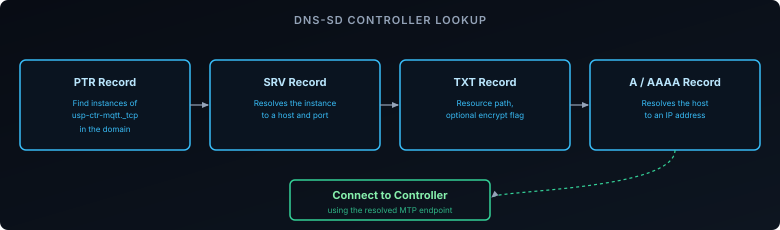

The [previous post]() covered why USP supports multiple independent Controllers managing one Agent. This one covers the mechanics behind that: how an Agent actually finds a Controller to talk to, since USP doesn't have a single "ACS URL" field the way a CWMP Endpoint does — [Discovery][1] is a defined process in its own right, with three distinct mechanisms.

## What the Agent Actually Needs to Learn

To reach a Controller, an Agent needs four things: which **MTP** to use (CoAP, MQTT, WebSockets, or STOMP), an **address**, a **port**, and — for MTPs that need one — a **resource path**. Discovery can hand the Agent all of this bundled as a single URL, or as an FQDN that the Agent resolves further via DNS-SD to get the rest.

USP defines three ways an Agent can learn this: **DHCP**, **DNS-SD**, and **mDNS**. Which one applies depends mostly on whether the Controller is somewhere on the internet (an ISP's own platform) or sitting on the same local network as the Agent (a smart-home hub, say).

## DHCP-Based Discovery

This is the USP analog of the [ACS URL via DHCP option 43]() covered in the provisioning post — but built to avoid the exact problem option 43 has. Option 43 is a flat, vendor-specific blob with no standard internal structure, so when a network has several unrelated vendors all repurposing the same option for their own provisioning needs, nothing stops their data from colliding or being misread by the wrong device.

USP avoids this by using DHCP's **vendor-identifying** options instead, which are keyed to an IANA-assigned enterprise number rather than shared blindly:

- The Agent's request carries the **DHCPv4 Vendor-Identifying Vendor Class Option (124)** — or **DHCPv6 Vendor Class (16)** — containing the Broadband Forum's enterprise number (`3561` / `0x0DE9`) and the literal string `usp`. This is how the Agent signals "I'm asking specifically for USP Controller information," not just any vendor data.
- The DHCP server responds with the **DHCPv4 Vendor-Identifying Vendor-Specific Information Option (125)** — or **DHCPv6 equivalent (17)** — scoped to that same enterprise number, carrying a defined set of encapsulated sub-options:

| Sub-option | Carries | Maps to |
|------------|---------|---------|
| `25` | Controller URL or FQDN | The MTP connection endpoint |
| `26` | Provisioning Code | `Device.LocalAgent.Controller.{i}.ProvisioningCode` |
| `27` | Retry minimum wait interval | `Device.LocalAgent.Controller.{i}.USPNotifRetryMinimumWaitInterval` |
| `28` | Retry interval multiplier | `Device.LocalAgent.Controller.{i}.USPNotifRetryIntervalMultiplier` |
| `29` | Controller Endpoint ID | `Device.LocalAgent.Controller.{i}.EndpointID` |

All five are decoded as strings — including the two that look numeric (the retry interval and multiplier) — so an Agent implementation can't assume it's safe to read them as raw integers off the wire.

Because DHCP itself has no built-in security, the specification is explicit that this is only safe to rely on when the link between the DHCP server and the Agent is one the operator actually controls — and that trust between the Agent and whatever Controller it discovers this way still needs to be established separately, typically with pre-configured certificates rather than assuming the DHCP response itself is trustworthy.

## DNS-SD Discovery

Where DHCP hands the Agent a Controller directly, DNS-SD (DNS Service Discovery) lets it look one up by service type — useful when the Controller's actual endpoint can change without the Agent needing reconfiguration. USP registers eight service names with IANA, one pair per MTP for each role:

| Service Name | MTP | Role |
|--------------|-----|------|
| `usp-agt-coap` | CoAP | Agent |
| `usp-agt-mqtt` | MQTT | Agent |
| `usp-agt-stomp` | STOMP | Agent |
| `usp-agt-ws` | WebSocket | Agent |
| `usp-ctr-coap` | CoAP | Controller |
| `usp-ctr-mqtt` | MQTT | Controller |
| `usp-ctr-stomp` | STOMP | Controller |
| `usp-ctr-ws` | WebSocket | Controller |

A lookup walks the standard DNS-SD record chain: a **PTR** record finds service instances of a given type, an **SRV** record for that instance gives the actual host and port, a **TXT** record carries attributes (a required `path` for both Agents and Controllers, a `name` for Agents, and an optional `encrypt` flag), and finally an **A**/**AAAA** record resolves the host to an address.

## mDNS on the Local Network

DHCP and DNS-SD both assume some shared infrastructure — a DHCP server or a real DNS zone. On a local network with neither, USP falls back to **mDNS** (RFC 6762) — the same `.local` multicast mechanism used for LAN service discovery generally. An Agent resolving a Controller FQDN ending in `.local` does it via mDNS instead of the ordinary DNS hierarchy, and any USP Endpoint supporting mDNS is required to implement both the client and server sides — since a Controller discovering Agents on the LAN needs to receive queries, not just send them.

This is the path a local smart-home hub would use to find Agents on its own network, as distinct from an ISP's cloud platform reaching a device over the internet via DHCP or DNS-SD.

## Recap

- An Agent needs an MTP, address, port, and (if the MTP requires it) a resource path to reach a Controller — delivered either as one URL or as an FQDN resolved further via DNS-SD.
- **DHCP discovery** uses vendor-identifying options keyed to the Broadband Forum's enterprise number (`3561`) rather than a flat blob like CWMP's option 43 — the Agent requests via option 124/16, the server responds via option 125/17 with five defined sub-options (URL, provisioning code, retry parameters, Endpoint ID), all decoded as strings.
- DHCP has no built-in security, so trust with a DHCP-discovered Controller still has to be established separately — usually with pre-configured certificates.
- **DNS-SD discovery** uses eight IANA-registered service names (`usp-agt-*`/`usp-ctr-*`, one pair per MTP) and the standard PTR → SRV → TXT → A/AAAA record chain to resolve a Controller.
- **mDNS** handles discovery on a local network with no DHCP or DNS infrastructure to lean on, resolving `.local` addresses directly between Agent and Controller.

Finding a Controller is only half the story — once an Agent has more than one, something has to stop them from stepping on each other. See [TR-369 Explained: Keeping Multiple Controllers From Stepping on Each Other]() for the Controller Trust permission model that makes that safe.

[1]: https://github.com/BroadbandForum/usp/blob/master/specification/discovery/index.md
