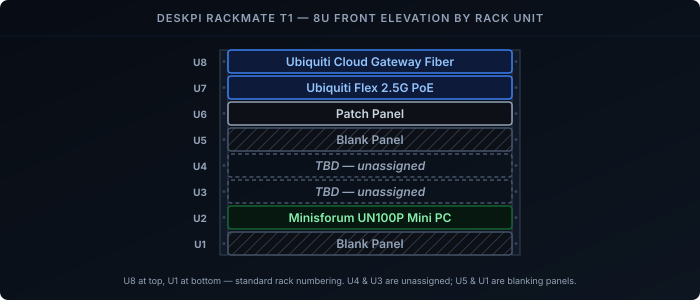

A full 19-inch rack is overkill for a home setup that's really just a gateway, a switch, a Pi or two, and a small NAS. A 10-inch mini rack fits the same gear on a desk or shelf without dominating the room. The [DeskPi RackMate T1](https://deskpi.com/products/deskpi-rackmate-t1-2) is one of the more common options: a die-cast aluminium frame, 8U tall, 10 inches wide, flat-packed, with a whole ecosystem of 0.5U and 1U accessories built around it. (DeskPi sent me the RackMate T1 to try out.)

> **Work in progress.** This build isn't finished — a few parts are still on order and some slots aren't decided yet. I'll fill this post in as pieces arrive.

## What the RackMate T1 Actually Is

- **10-inch rack width.** The mounting rails sit 254 mm apart on centre — narrower than the 19-inch (483 mm) rails on a standard rack. Vertically it still follows the normal standard: 1U = 44.45 mm, so 8U of usable mounting height.
- **8U of space**, open front and back — the base T1 has no door, just translucent acrylic side panels for dust and looks.
- **Die-cast aluminium frame.** It's rigid once assembled and heavier than it looks.
- **Roughly 280 × 200 × 405 mm** overall on the base model (W × D × H). Depth is the dimension that actually catches people out.

## The Depth Trap

The single biggest mistake with a 10-inch rack is assuming your gear fits front-to-back. Usable depth behind the rails is only around 180–200 mm, and connectors and cable bend radius eat into that further — so measure the deepest thing you plan to rack, including any inline power brick, before ordering anything. Skip this and you'll end up like a lot of "10-inch rack" builds: the switch or NAS on a shelf facing sideways, rails purely structural.

## Planning the Layout

Work out the U budget before assembly — it's much easier to plan on paper than to reshuffle a populated rack.

| U | Item | Mounting |
|---|------|----------|
| 8 | Ubiquiti Cloud Gateway Fiber | |
| 7 | Ubiquiti Flex 2.5G PoE | |
| 6 | Patch Panel | |
| 5 | Blank Panel | |
| 4 | TBD | |
| 3 | TBD | |
| 2 | Minisforum UN100P Mini PC | |
| 1 | Blank Panel | |

A few rules of thumb:

- **Heaviest at the bottom.** A NAS or anything with spinning disks goes in the lowest U so the rack isn't top-heavy on a desk.
- **Leave a gap above anything warm.** Passive cooling in an open frame works, but only if hot air can rise away from the device instead of straight into the next one.
- **Reserve 0.5U or 1U for a patch/cable-management panel** near the top or middle — it's the difference between a tidy build and a bird's nest.
- **Blank the gaps you're not using** if you later add a door or want the airflow to behave predictably.

That's the plan on paper — next is actually getting each device to stay put.

## Mounting the Gear

None of this gear ships with 10-inch rack ears, so it's all riding on shelves rather than bolted straight to the rails:

- **Ubiquiti Cloud Gateway Fiber** and **Minisforum UN100P Mini PC** each sit on their own 1U vented shelf — two extra shelves bought on top of the standard kit parts, held with cable ties or hook-and-loop.
- **Ubiquiti Flex 2.5G PoE** will also get a shelf — still on order.
- **Patch Panel** will be DeskPi's own 10-inch panel, which comes with its own ears, so it mounts straight to the rails.
- **Blank panels** fill the rest.

With everything physically mounted, the next job is getting power to it.

## Power

I went with the [DIGITUS 10" PDU](https://www.amazon.nl/dp/B0H8354DHB) — the only affordable EU-plug PDU I could find for a rack this size. It's mounted at the rear, and gives 4 plugs, which is enough for now to power the gateway, switch, and mini PC.

Power sorted, the next question is how much of that turns into heat.

## Cooling

An open frame with the side panels on is mostly passive — fine for a gateway, a switch, and a couple of Pis. It stops being fine when you add anything that runs hot continuously (a NAS under load, a mini PC doing transcoding).

Options if you need airflow:

- **A 1U or 2U fan panel** (DeskPi sells a 1U quad and a 2U dual) mounted above the warm device, pulling air up and out.
- **A single USB or Noctua fan** zip-tied to a post, aimed across the hot spot. Quieter, less tidy.
- **A fan panel at the bottom of the rack**, pushing air up from below instead of pulling it out above — works well when the heat source is low in the stack.
- **Just leave a 1U gap** above anything warm and skip active cooling entirely — often enough at this scale.

Airflow sorted (or deliberately skipped), the last mechanical job is keeping all the resulting cabling under control.

## Cable Management

- A **0.5U cable-management panel with D-rings**, mounted at the rear facing inward, near the middle of the rack gives every patch cable a defined path.
- Use short cables. A 2 m patch lead in a 280 mm-wide rack is 1.7 m of loop to hide. DeskPi and others sell 0.2 m and 0.5 m CAT6 leads sized for this.
- Velcro, not zip ties, on anything you'll re-patch.
- Label both ends of every cable now, not later.

That's the build mechanics covered — here's what it's actually cost so far.

## Cost and Time

| Item | Cost |
|------|------|
| [RackMate T1](https://deskpi.com/products/deskpi-rackmate-t1-2) | €143,20 |
| [Shelves](https://deskpi.com/products/deskpi) | €45,99 |
| [Cable management panel](https://deskpi.com/products/10inch-server-rack-0-5u-rack-cable-management-panel-with-3-d-rings) | €11,99 | 
| PDU or power strip | €19,95 |
| **Total** | **€221,13** |

Assembly and racking everything: about 2 hours.

That's where the build stands for now — the Flex switch, patch panel, and whatever ends up in U3/U4 are still on order, and I'll update this post as they arrive.
